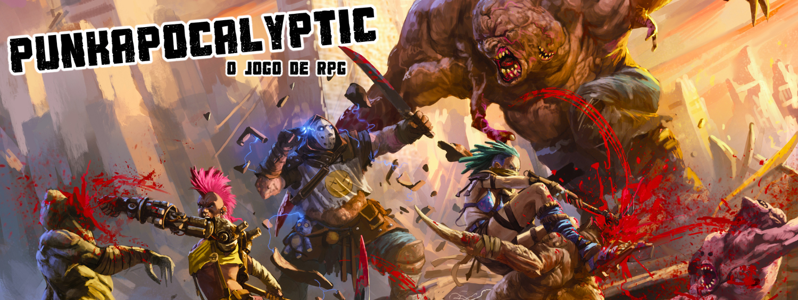
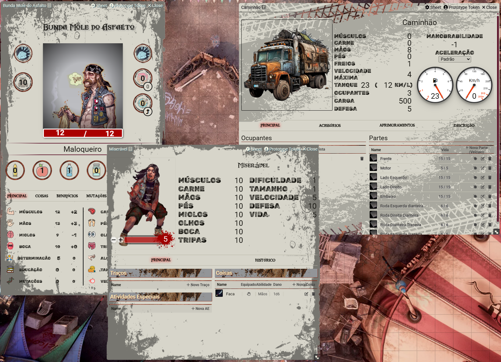

  
  
  
  
 
   
  
  

# Punkapocalyptic System

The system for playing Punkapocalyptic RPG on Foundry VTT.

The core system features no content. It only provides support for various mechanics required to play the game:
- Character, NPC, and Vehiecles sheets.
  - Integrated roll mechanics.
- Items:
  - Armor
  - Benefit
  - Generic Item
  - Weapon
  - Trait
  - Mutation
  - Background
  - Special Activity
  - Path
  - Talent

The image below is for illustrative purposes only. This system does not include images, statistics, or other details containing intellectual property from the book. To use this system properly, we recommend purchasing the official book directly from the publisher's website.

# Install 
Open your Foundry's admin dashboard and search for the system. I do not recommend manual installations, as Foundry supports direct installation. If you're a developer interested in contributing and need help configuring the system in your environment, feel free to open an issue.

# Support
This system is supported by [Tria Editora](https://triaeditora.com.br/), the publisher responsible for translating Punkapocalyptic into Portuguese and distributing it in Brazil.

# Licenses
- **Logo and Content**: The Punkapocalypitc logo and content is Copyright © and Trademarked by Schwalb Entertainment, LLC. The parts of this project protected under this copyright may not be distributed commercially or freely. This includes art, logo, and copyright text sourced from the Punkapocalyptic tabletop RPG.
- **Source Code**: All source code (javascript, hbs, scss, as well as system templates and the like), are licenced under the GNU General Public License v3.0.
- **Foundry VTT**: The project is created following the Foundry VTT Limited License Agreement for module development.
- **Fonts**: The fonts used in this project carry their own licenses and can be find on [Google Fonts](fonts.googleapis.com)
- Icons: Icons are licensed and distributed by https://www.flaticon.com/
- **Background Images**: The background images for the sheets are licensed and distributed by:
  - Free Pik: https://www.freepik.com/ having the following authors:
    - [nikitabuida](https://www.freepik.com/author/nikitabuida)
    - [DesignerSaidur](https://www.freepik.com/author/designersaidur)
    - [Kjpargeter](http://www.freepik.com/Kjpargeter)
  - Love Pik
    - [Vintage Old Side Png vectors](https://lovepik.com/images/png-vintage-old-side.html)
  - Png Wing
    - [Tires background](https://www.pngwing.com/en/free-png-aohsz)

 
